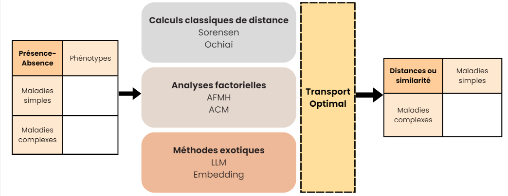

```{r setup, include=FALSE}
knitr::opts_chunk$set(echo = TRUE)
```

```{r}

# Nettoyage initial de l'environnement
rm(list = ls())
```

```{r}
# Chargement des bibliothèques nécessaires
library(tidyverse)
library(plotly)
```

Ce document résume les questionnements et les avancées réalisées durant le premier mois du projet ingénieur *Mandalorian*.

# 1.Introduction

## 1.1.Compréhension du sujet

Les maladies simples sont **monogéniques**, localisées sur les exons, et bien étudiées. Elles déclenchent des phénotypes précis, permettant d'identifier facilement le lien entre un phénotype et le gène impliqué.\
En revanche, les maladies complexes sont **multigéniques** et impactent d'autres régions moins bien connues que les exons. Il est donc difficile, à partir des phénotypes, de déterminer les gènes impliqués.

**Objectif** : Proposer, pour chaque maladie complexe, une liste des gènes impliqués. Pour cela, nous exploitons les maladies simples proches d'une maladie complexe donnée pour identifier des phénotypes communs, permettant de remonter aux gènes responsables.

## 1.2.Hypothèses et postulats

Nous partons des hypothèses suivantes :

-   Il est possible de comprendre les maladies complexes en les rapprochant de maladies simples similaires.

-   Nous négligeons l’épistasie (interactions complexes entre l'expression de plusieurs gènes).

## 1.3.Structure du projet

Le projet s’articule autour de trois étapes principales :

1.  **Calcul d’une matrice de distance ou de similarité** : Projection des maladies simples et complexes dans un espace commun, suivi du calcul des distances.

2.  **Définition d’un seuil d’assignation des gènes** : Utilisation d’un seuil global ou spécifique à chaque maladie complexe.

3.  **Interprétation des résultats** : Exploitation de modèles de langage (LLMs) pour interpréter les gènes assignés. *(Étape non débutée)*

# 2.Le jeu de données

## 2.1. Structure des données

### Points clés :

-   **Maladie simple** : 1 gène → plusieurs phénotypes (données connues).

-   **Maladie complexe** : plusieurs gènes → plusieurs phénotypes (gènes inconnus mais recherchés).

```{r message=FALSE, warning=FALSE}
load("C:/Users/lesli/OneDrive/3a/M2PI-Mendelienne/Data/data_clean0.RData")

or_df0[1:10,1:10]
```

Les données initiales incluent des phénotypes (colonnes) et des maladies (lignes), couvrant :

-   **6125 maladies simples** issues de la base `omim`.

-   **966 maladies complexes** issues de la base `phecode`. Parmi elles, deux maladies n'ont pas de phénotypes communs avec les maladies simples (à évaluer pour une éventuelle exclusion).

Il existe une variabilité intra-maladie pour les phénotypes. Un "1" dans la matrice de présence-absence ne signifie pas que ce phénotype est observé pour l'ensemble des patients atteint de cette maladie. De même un "0" ne signifie pas forcément que le phénotype n'est pas observé pour cette maladie mais qu'il n'est pas suffisamment observé pour être considéré.

On retrouve dans le jeu de données des groupes de maladies (simples et complexes) ayant les mêmes profils phénotypes. Une fréquence différente de leurs phénotypes ou une intensité phénotypique pourrait différencier ces maladies mais en l'absence d'une connaissance métier il nous est impossible de différencier ces maladies dans le jeu de données.

```{r message=FALSE, warning=FALSE}
# chargement des groupes de maladies 
load("Data/df_lignes_identiques.RData")

head(df_lignes_identiques)
```

## 2.2. Hiérarchie phénotypique

```{r message=FALSE, warning=FALSE}

# Chargement des données de phénotypes
if (!require("ontologyIndex")) install.packages("ontologyIndex", repos = "http://cran.us.r-project.org")
library(ontologyIndex)

# Récupération de l'ontologie HPO
hpo_url <- "https://raw.githubusercontent.com/obophenotype/human-phenotype-ontology/master/hp.obo"
hpo <- get_ontology(hpo_url, extract_tags = 'everything')


path <- read_csv("Data/Path_Phenotypes.csv")
path <- path %>% 
  mutate_if(is.character, as.factor)

phenotype_names <- as.list(hpo$name)

path[1:10,1:10]
```


Les phénotypes suivent une hiérarchie **complexe** :

-   Un phénotype peut avoir plusieurs parents directs.

-   Certaines branches convergent après plusieurs niveaux (pas forcément le même nombre de niveaux des deux côtés).

-   Les profondeurs des branches varient.

-   Les niveaux les plus fins ne sont pas toujours connus, compliquant les comparaisons.

```{r message=FALSE, warning=FALSE}
df <- or_df0

# Étape 1 : Remplacer "." par ":" dans les noms de colonnes du DataFrame
formatted_colnames <- gsub("\\.", ":", colnames(df))

# Étape 2 : Remplacer les noms des colonnes en fonction du vecteur de correspondance
colnames(df) <- phenotype_names[formatted_colnames]

# Résultat
df[1:10,1:10]
```

# 3.Calcul de la matrice de distance et/ou de similarité

Nous avons identifié plusieurs méthodes pour obtenir une matrice de distance ou de similarité entre les maladies. Ces méthodes peuvent inclure un **filtre de transport optimal**, qui reste à explorer.



## 3.1. Calculs classiques

### Modes de distance :

-   **Q-mode** : Comparaison d'objets (cas pertinent ici).

-   **R-mode** : Comparaison de descripteurs.

Dans notre cas on se place plutôt dans le cas Q, donc sur un calcul de similarité/distance. Nos données sont des matrices de 0 et 1 pour présence-absence. L'absence ne signifie pas que le phénotype n’est pas présent mais qu’il n’est pas observé dans une part suffisante de la population. Analogie avec l’écologie (*“The species does not show a regular distribution among the sites under study”*)

Nos données étant binaires (présence/absence), plusieurs métriques asymétriques sont adaptées :

1.  **Coefficient de Jaccard**\
    $$D_J(x_1, x_2) = 1 - \frac{|x_1 \cap x_2|}{|x_1| + |x_2| - |x_1 \cap x_2|}$$

    -   Favorise les présences communes.

    -   a : Nombre de phénotypes partagés.

    -   b, c : Différences entre $x_1$ et $x_2$.

2.  **Coefficient de Sørensen**\
    $$D_S(x_1, x_2) = 1 - \frac{2a}{2a + b + c}$$

    -   Donne plus de poids aux présences communes que Jaccard, idéal pour ce projet.

3.  **Distance d’Ochiai**\
    $$D_O(x_1, x_2) = 1 - \frac{|x_1 \cap x_2|}{\sqrt{|x_1||x_2|}}$$

    -   Fréquemment utilisée en bioinformatique, notamment pour les gènes.

Ces méthodes de calcul classiques présentent des limitations importantes dans le cadre de notre étude, car elles ne prennent pas en compte la hiérarchie intrinsèque des phénotypes lors du calcul des distances. En l'absence d'une prise en charge explicite de cette hiérarchie, plusieurs biais peuvent émerger :

1.  **Absence de données au niveau le plus fin** : Lorsque les phénotypes les plus détaillés ne sont pas notés pour une maladie mais le sont pour une autre, cela augmente le nombre de "0" dans la matrice. Cette disparité engendre une surestimation des distances entre ces maladies, les faisant paraître plus dissemblables qu'elles ne le sont réellement.

2.  **Rapprochements artificiels** : À l'inverse, deux maladies pourraient apparaître plus similaires qu'elles ne le sont en réalité si elles partagent des phénotypes communs au niveau supérieur de la hiérarchie, mais diffèrent au niveau des sous-phénotypes plus spécifiques qui ne sont pas notés. Cette simplification peut masquer des distinctions importantes et fausser les conclusions sur leurs proximités réelles.

Ces biais mettent en évidence une lacune majeure des métriques binaires classiques comme Jaccard, Sorensen ou Ochiai dans notre contexte. Sans prise en compte de la structure hiérarchique des phénotypes, ces méthodes risquent d’interpréter à tort des absences ou des similitudes, conduisant à des regroupements ou des distinctions non fiables entre maladies.

## 3.2. Analyses factorielles

L'objectif des analyses factorielles est de projeter les maladies complexes (MC) dans un espace défini par les maladies simples (MS). Pour ce faire, les maladies complexes sont traitées comme des individus supplémentaires, tandis que l'espace de représentation est construit exclusivement à partir des maladies simples.

Bien que le tableau combinant MS et MC ne contienne pas de colonnes entièrement composées de zéros, certains phénotypes peuvent être exclusifs aux MS ou aux MC. Cette spécificité complique les analyses factorielles, en particulier lorsqu'il s'agit de distinguer les **individus actifs** des **individus supplémentaires**.

### 3.2.1. Analyse des Correspondances Multiples (ACM)

Initialement, deux approches étaient envisagées :

1.  Réaliser une ACM en traitant les phénotypes comme des variables distinctes.

2.  Effectuer une AFC (Analyse Factorielle des Correspondances) en regroupant les phénotypes sous une seule variable générale "Phénotype" avec plusieurs modalités.

Cependant, une AFC suppose que le tableau d’entrée est un **tableau disjonctif complet**, où chaque ligne contient exactement une modalité active (un seul "1", excluant les autres). Cela n'est pas conforme à nos données, car plusieurs phénotypes peuvent être actifs simultanément pour une même maladie. Par conséquent, l’ACM est plus adaptée.

#### Résultats de l'ACM

Pour des raisons computationnelles, nous avons limité l'analyse à **5 dimensions principales**. Les distances calculées incluent :

-   **Distance euclidienne**

-   **Distance de Manhattan**

Les coordonnées des maladies complexes et simples, obtenues via l'ACM, ont permis de calculer ces distances. Cependant, ces distances sont dérivées des coordonnées initiales basées sur une **distance du chi²**, ce qui pose la question de la pertinence d'une "distance de distance".

```{r message=FALSE, warning=FALSE}

# chargement des matrices de distances 
load(file = 'Data/distance_acm.RData')

# Conversion de la matrice en tableau long
dist_long <- as.data.frame(as.table(dist_acm_eucli_mx))

# Renommer les colonnes pour ggplot
colnames(dist_long) <- c("MC", "MS", "Distance")

# Visualisation avec ggplot2
ggplot(dist_long, aes(x = MS, y = MC, fill = Distance)) +
  geom_tile() +
  scale_fill_gradient(low = "beige", high = "firebrick") +
  theme_minimal() +
  labs(title = "ACM - Distance euclidienne",
       x = "Maladies Simples",
       y = "Maladies Complexes",
       fill = "Distance")+
  theme(axis.text = element_blank())


```

### 3.2.2. Analyse Factorielle Multiple (AFM)

L'AFM était envisagée comme une méthode pour intégrer la **hiérarchie des phénotypes** dans l'analyse. Cette méthode permettrait de regrouper les variables en blocs distincts, reflétant les niveaux hiérarchiques des phénotypes.

#### Difficultés rencontrées

L'idée a été abandonnée en raison de plusieurs problèmes inhérents à la hiérarchie des phénotypes :

1.  **Non-linéarité** : Les phénotypes peuvent appartenir à plusieurs branches ou niveaux de l'arbre.

2.  **Développement inégal des branches** : Certaines branches sont beaucoup plus détaillées que d'autres, rendant les comparaisons entre niveaux complexes et biaisées.

3.  **Données incomplètes** : Le niveau le plus fin des phénotypes pour certaines maladies n'est pas toujours disponible, ce qui réduit la cohérence des comparaisons.

Ces limitations rendent l'AFM moins appropriée pour notre problématique actuelle.

## 3.3.Embedding

Pour contourner les limitations liées à la hiérarchie des phénotypes, nous explorons l’utilisation de l’**embedding**, une technique permettant de représenter des mots, des phrases ou des entités sous forme de vecteurs dans un espace numérique. Cette méthode offre une alternative puissante et flexible aux approches classiques de calcul de distances, en particulier dans notre contexte.

#### Processus d’Embedding Utilisé

L’embedding repose sur la vectorisation de mots individuels ou de phrases entières :

1.  Chaque mot de la phrase est converti en un vecteur dans un espace vectoriel pré-entraîné.

2.  Pour représenter une phrase ou une entité, comme une maladie, la moyenne des vecteurs des mots individuels est calculée.

3.  Une matrice de similarité, telle que celle basée sur le cosinus, est ensuite construite pour mesurer les proximités entre entités.

#### Modèles d’Embedding Utilisés

Nous avons exploré des modèles avancés basés sur l'architecture BERT, notamment :

-   **RoBERTa (Robustly Optimized BERT Approach)** : Améliore BERT avec des optimisations dans l’entraînement, particulièrement adaptées pour des tâches nécessitant une compréhension fine des relations sémantiques.

-   **HessBERT** : Une variante optimisée de BERT pour des applications spécifiques.

Ces modèles utilisent une technique appelée **modélisation du langage masqué**, où des mots aléatoires dans une phrase sont masqués pour entraîner le modèle à prédire les mots manquants. Cela diffère de modèles comme GPT, qui apprennent de manière non supervisée en prédisant le mot suivant dans une séquence.

#### Application de l’Embedding au Contexte des Maladies

Pour générer des embeddings adaptés aux maladies complexes, nous utilisons un **prompt spécifique** qui contextualise les phénotypes de chaque maladie :

> *"We are a group of individuals suffering from the same disease, but it manifests itself differently in each of us. Here is a list of the symptoms we may experience: [...]"*

Ce prompt met en avant les variations intra-maladie tout en conservant une structure commune pour faciliter la vectorisation. Les vecteurs obtenus permettent ensuite de calculer des matrices de distance ou de similarité entre maladies.

## 3.4.Transport Optimal (TO)

Le transport optimal est une méthode **holistique et exhaustive** permettant d'établir des correspondances entre les maladies mendéliennes et complexes. Son principal objectif est de **minimiser une distance globale** entre tous les gènes possibles, tout en considérant un ensemble complet de données.

**1. Avantages majeurs du transport optimal :**

-   **Exhaustivité des gènes étudiés :**\
    Contrairement à d'autres approches qui limitent l'analyse à un sous-ensemble de gènes ou de maladies, le transport optimal vise à "transporter tout sur tout". Cela garantit une prise en compte exhaustive de l'ensemble des gènes et phénotypes, sans restriction initiale.

-   **Dimension globale :**\
    En produisant une matrice de transport couvrant l'ensemble des relations possibles, cette méthode réduit les biais locaux qui pourraient survenir avec des algorithmes plus restreints.

-   **Efficacité algorithmique :**\
    Grâce aux avancées récentes, les problèmes de transport optimal peuvent désormais être résolus de manière performante et rapide, ce qui renforce leur pertinence dans notre contexte.

**2. Limites et questions soulevées :**

Bien que le transport optimal soit présenté comme une méthode globale et exhaustive, plusieurs interrogations subsistent quant à son application dans notre cas particulier :

-   **Pondération des maladies complexes :**\
    Pourquoi attribuer des poids différents aux maladies complexes en fonction de leur gravité ou du nombre de phénotypes associés, alors qu'aucune contrainte n'est imposée sur le nombre de maladies complexes auxquelles une maladie simple peut être liée ?

-   **Systèmes de pondération asymétriques :**\
    Actuellement, deux systèmes de pondération distincts sont utilisés pour les maladies simples et complexes. Cette séparation pourrait introduire une asymétrie qui biaise les résultats. Une solution possible serait d'unifier ces systèmes, en attribuant un poids unique à chaque maladie, basé par exemple sur le nombre de phénotypes associés.

**3. État actuel du projet :**

Pour le moment, le transport optimal **n'a pas encore été appliqué** dans nos méthodes. Une analyse comparative est en cours pour évaluer les résultats existants obtenus sur le projet avec et sans utilisation du transport optimal. Cette comparaison permettra de déterminer les différences entre cette méthode et nos résultats actuels.

# 4.Obtention d'une matrice d'assignation

Une des étapes importante du workflow consiste à passer de la matrice de distance à la matrice d'assignation. Pour cela il faut identifier un seuil à partir duquel on associe une maladie simple à une complexe. Plusieurs approches ont été testées pour déterminer un seuil pertinent. 

## 4.1.Seuil global

Ce seuil est fixe et s'applique à l'ensemble des maladies, en déterminant une distance maximale acceptable entre une maladie complexe et un gène.

## 4.2.Seuil individuel

Ce seuil est défini en fonction des quantiles de la distribution des distances pour chaque maladie, permettant ainsi une certaine individualisation du seuil en fonction de chaque cas.

Cependant, l'approche du seuil individuel présente des limitations. En effet, cela conduit souvent à de nombreuses assignations, même pour des distances très grandes (par exemple, supérieures à 0.9), notamment pour les maladies complexes. En outre, la matrice de distance de base influence fortement le résultat de l'assignation des gènes.

## 4.3.Seuil critique

Afin de rendre la sélection du seuil plus robuste, nous avons trouvé intéressant d’introduire un **seuil critique**, similaire à une **p-value critique**. Il a donc fallu que nous l’estimions. Ceci est possible de deux façons. 

### 4.3.1.Estimation de la P-value empirique par proportion

Cela consiste à approximativement calculer la p-value à partir de la matrice des distances en observant la proportion de distances inférieures à la distance considérée.

### 4.3.2.Estimation de la P-value empirique par permutations

Cette méthode repose sur la permutation d’un maladie complexe dans le jeu de données initiale (en modifiant aléatoirement les associations entre maladies complexes et simples en changeant son phénotype), puis en calculant de nouveau les distances entre la maladie complexe permutée et les autres maladies.

L'idée derrière la p-value par permutation est de tester l’hypothèse nulle H0​ selon laquelle **il n’existe pas de liens d’association** entre une maladie complexe et les maladies simples. À l’inverse, l'hypothèse alternative H1​ stipule qu'il existe bien une association significative.

Pour tester cette hypothèse, nous effectuons un **test de randomisation**, qui consiste à casser la structure de l'association présumée entre la maladie complexe et les autres maladies simples. Concrètement, cela revient à permuter les valeurs binaires (0 et 1) associées à chaque maladie complexe, tout en conservant les données des maladies simples inchangées et la proportion de 0 et de 1 pour chaque maladie complexe. Ces permutations "casseront" les associations naturelles et généreront des configurations aléatoires.

Ensuite, pour chaque permutation, nous recalculons la distance entre la maladie complexe permutée et les maladies simples. En répétant ce processus de nombreuses fois, on obtient une **distribution empirique des distances**, qui reflète la variation des distances dans le cas où il n'y aurait aucune association réelle, c'est-à-dire sous l'hypothèse nulle.

Lors de chaque permutation, on retient la **valeur minimale** des distances obtenues, et cette valeur constitue un seuil critique. Ce seuil est considéré comme une valeur de distance en dessous de laquelle une association est jugée significative. Enfin, la **distance observée** entre la maladie complexe réelle (non permutée) et les maladies simples est comparée à cette distribution empirique. Si cette distance observée est inférieure à la valeur minimale de la distribution empirique, on conclut que l’association entre la maladie complexe et les maladies simples est significative et donc **non due au hasard**.

#### Problème intrinsèque aux données 

Un point important soulevé concerne la gestion de la hiérarchie des phénotypes. Ces derniers sont organisés en niveaux de granularité variable (allant de 1 à 12), ce qui engendre plusieurs problématiques. Lorsqu'on compare des maladies avec  des phénotypes appartenant à des niveaux hiérarchiques différents (par exemple, un phénotype le plus fin de niveau 3 avec un phénotype le plus fin de niveau 8), on se heurte à plusieurs difficultés :

-   **Incohérence d'échelle** : Comparer deux maladies avec des phénotypes de niveaux différents revient à confronter des informations qui ne sont pas directement comparables. Un phénotype de niveau 8 contient une quantité d’information beaucoup plus précise et détaillée qu’un phénotype de niveau 3. De plus, la manière dont nous avons construit les phénotypes, en attribuant des "1" à tous les phénotypes parents lorsqu’un phénotype enfant (plus fin) est rencontré, entraîne une différence de poids entre les différentes branches. Certaines branches, contenant des phénotypes enfants, ont un poids plus important, car elles comportent davantage de "1", ce qui peut fausser les comparaisons.

-   **Perte d'information** : Une maladie associée uniquement à des phénotypes de niveau 3 (moins détaillés) risque de manquer d’informations par rapport à une maladie qui inclut des phénotypes de niveau 3, mais aussi des niveaux plus fins (par exemple, niveaux 4, 5 ou 6). La question se pose alors : une maladie qui se limite à des phénotypes de niveau 3 est-elle vraiment au "niveau le plus fin", ou lui manque-t-il des informations essentielles ? Faut-il l'éloigner d'une maladie qui couvre ces mêmes phénotypes, mais avec des niveaux plus détaillés ? Cette différence pourrait rendre difficile l’identification de relations pertinentes entre les maladies

D’autre part, l’idée d’éloigner une maladie moins détaillée pourrait sembler raisonnable si l’on cherche à maximiser la correspondance exacte des phénotypes. Toutefois, cela pourrait entraîner une perte d’informations pertinentes. En effet, une maladie avec des phénotypes moins détaillés pourrait encore partager des traits fondamentaux avec une maladie plus détaillée, même si elle n’inclut pas tous les niveaux fins. 

Le véritable défi réside dans la gestion de cette hiérarchie, qui peut entraîner une **perte d’information importante** pour certaines maladies dont les données ne sont pas au niveau le plus fin.

# 5.Grands Modèles de Language (LLM)
