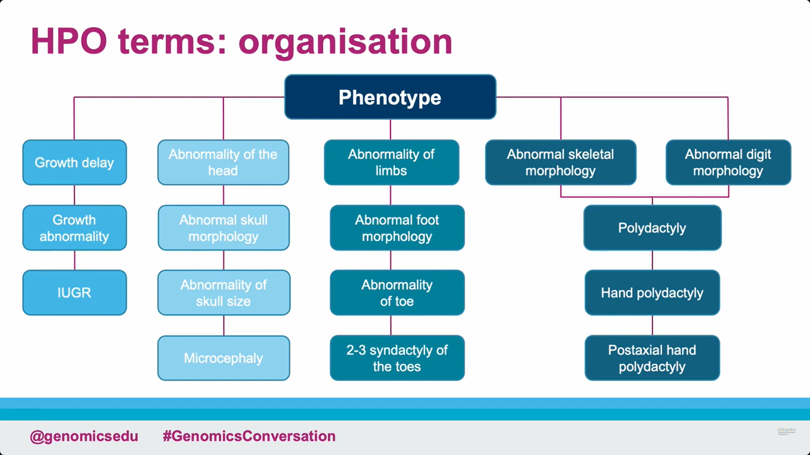

```{r setup, include=FALSE}
knitr::opts_chunk$set(echo = TRUE)
```

```{r}
rm(list = ls())
```

```{r}
library(tidyverse)
```

Ce document a pour objectif de décrire les questionnements et avancés réalisés durant le premier mois du projet ingénieur Mandalorian.

# 1.Introduction

## 1.1.Compréhension du sujet

Les maladies simples sont monogéniques, sur les exons et très bien étudiées. On connaît de façon précise les phénotypes qu’elles déclenchent. On peut donc identifier le lien entre phénotype et gène impliqué. \
Au contraire, les maladies complexes sont multi-géniques et impactent d’autres régions moins connues que les exons. Il est donc difficile à partir des phénotypes de comprendre quels gènes sont impliqués. 

L’objectif final de notre étude est de proposer, pour chaque maladie complexe, une liste des gènes impliqués. Pour cela, nous exploitons les maladies simples proches de la maladie complexe étudiée afin d’identifier des phénotypes communs, ce qui nous permet de remonter aux gènes responsables grâce à la correspondance bien établie entre phénotype et gène dans le cas des maladies simples.

## 1.2.Hypothèses et postulats

Nous partons du postulat qu’il est possible de comprendre les mécanismes des maladies complexes en les rapprochant de maladies simples qui leur sont similaires. 

## 1.3.Structure du projet

Nous avons identifié 3 étapes majeures dans ce projet.

### Étape 1 : Calcul d'une matrice de distance ou de similarité

Afin d'assigner les gènes à chaque maladie complexe, il est d'abord nécessaire de projeter les maladies complexes et maladies simples dans un même espace est d'ensuite déterminer les distances entre maladies simples et maladies complexes.

### Étape 2 : Choix d'un seuil pour l'assignation des gènes à chaque maladie complexe

L'assignation peut faire appel à un seuil individuel, calculé pour chaque maladie complexe, ou un seuil global, similaire pour chaque maladie.

### Étape 3 : Interprétation

Cette étape ferait appel aux LLM pour interpréter la liste de gènes assignée à chaque maladie.\
L'étape 3 n'a pas encore débuté.

# 2.Le jeu de données

1 gène = plusieurs phénotypes \
1 phénotype = plusieurs gènes\
Maladie Simple = 1 gène = plusieurs phénotypes (ça on connait bien)\
Maladie Complexe = plusieurs gènes = plusieurs phénotypes (on ne connaît pas les gènes mais c'est ce que l'on cherche).

## 2.1. Jeu de données sur lequel on travaille 

Le jeu de données initiales contient en colonne les phénotypes et en lignes les maladies simples puis complexes

```{r include=FALSE}
load("C:/Users/lesli/OneDrive/3a/M2PI-Mendelienne/Data/data_clean0.RData")
```

```{r}
or_df0[1:10,1:10]
```

On a 6125 maladies simples issues de la base `omim` et 966 maladies de la base `phecode`. Sur ces 966 maladies complexes, 2 maladies n'ont pas de phénotypes communs avec les maladies simples. À savoir si nous devons retirer ces deux maladies du jeu de données.

## 2.2.Données de base

```{r}
# Load necessary library
if (!require("ontologyIndex")) install.packages("ontologyIndex", repos = "http://cran.us.r-project.org")
library(ontologyIndex)

# Load the HPO file
hpo_url <- "https://raw.githubusercontent.com/obophenotype/human-phenotype-ontology/master/hp.obo"
hpo <- get_ontology(hpo_url, extract_tags = 'everything')


path <- read_csv("Data/Path_Phenotypes.csv")
path <- path %>% 
  mutate_if(is.character, as.factor)

phenotype_names <- as.list(hpo$name)

path[1:10,1:10]
```



La hiérarchie n'est pas linéaire. Un phénotype peut avoir plusieurs parents directs. Certaines branches de l'arbre phénotypique se séparent pour se retrouver plus tard après plus ou moins de noeuds des deux côtés. Cela entraîne un autre problème car on peut retrouveer un phénotype à plusieurs niveaux de la hiérarchie de l'arbre. Aussi, les branches ne sont pas forcément toutes développées aux même niveaux. Ainsi un niveau 3 dans une branche n'est pas forcément équivalent à un niveau 3 dans une autre branche. Enfin, nous ne sommes pas surs que nous connaissons le niveau le plus fin de phénotypes pour chaque maladie. Cela peut également entrainer des problèmes dans la comparaison des maladies dedux à deux.

```{r}
df <- or_df0

# Étape 1 : Remplacer "." par ":" dans les noms de colonnes du DataFrame
formatted_colnames <- gsub("\\.", ":", colnames(df))

# Étape 2 : Remplacer les noms des colonnes en fonction du vecteur de correspondance
colnames(df) <- phenotype_names[formatted_colnames]

# Résultat
df[1:10,1:10]
```

# 3.Calcul de la matrice de distance et/ou de similarité


